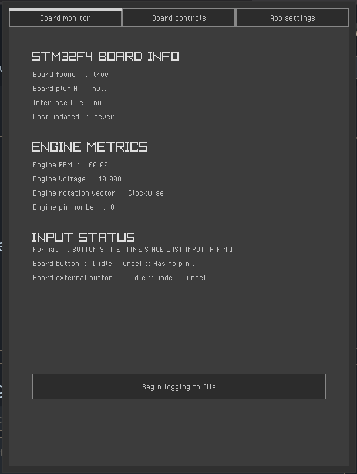
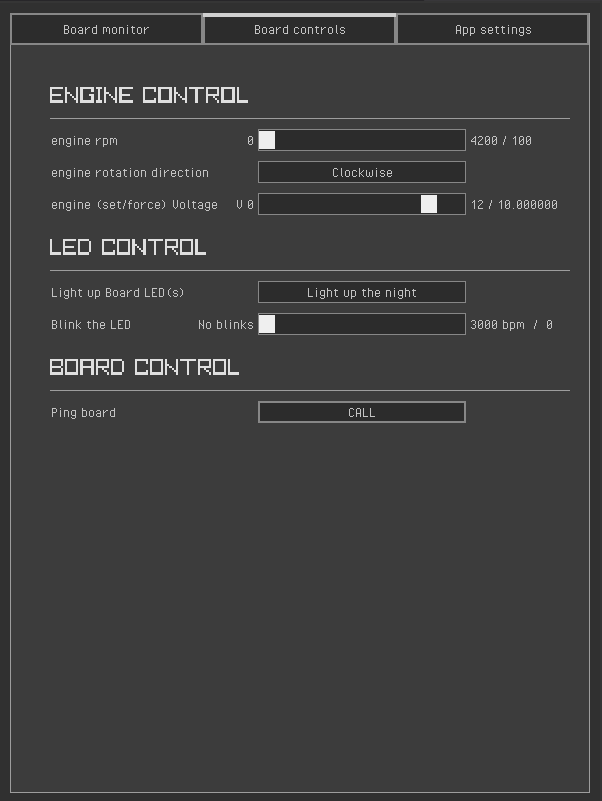
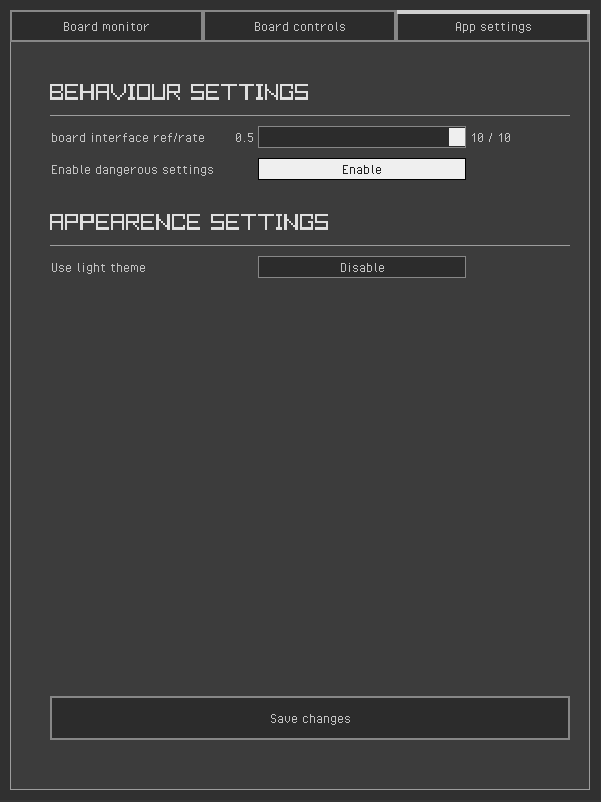
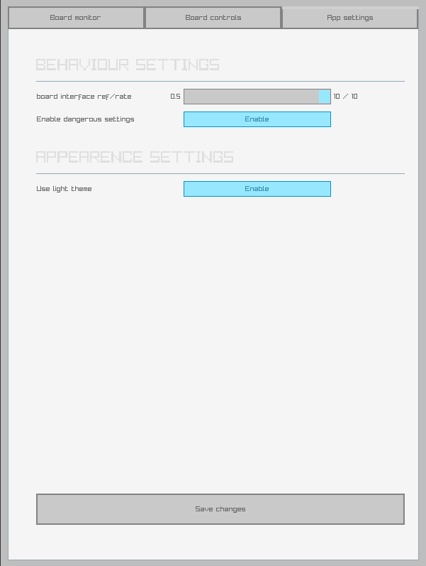

= Software High Level 
== ABOUT

Branch purpouse is to host high level programs on the chain to communicate with STM32F4 series board.

=== Branch features:
==== control panel
Panel that allows user to have control over board with ease. Software writes to interface files,
that act like Send/Recive system. The reciver is a "bridge" program that translates all text calls into
signals and sends them directly to the board via USB.

.overview:
  - stm32.in 
      1. input we send to the board to accept and behave
  - stm32.out
      2. output we recive from board 
  - stmpanel.conf
      3. configuration file for panel
  - example/*.template
      4. example files or "templates" for both interfaces and config file
      
==== Bridge

*TBD*

== BUILDING

1. install raylib and all its dependencies 
2. clone the repo and navigate to panel dir

----
git clone --depth 1 https://github.com/amuerta/SpecialArch.git
git checkout swhl
cd ./SpecialArch/control_panel/
----
3. (OPTIONAL) modify build script if you running Windows.
4. build and run

----
make run
----

== PANEL APPEARANCE

.panel metrics page 

.panel control page

.panel settings page

.panel light theme

