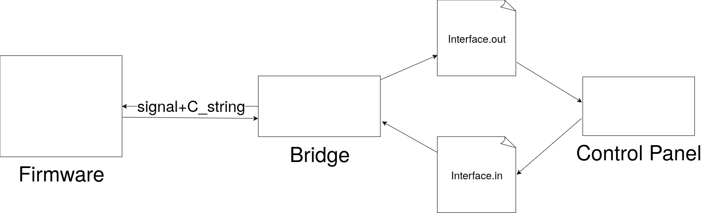
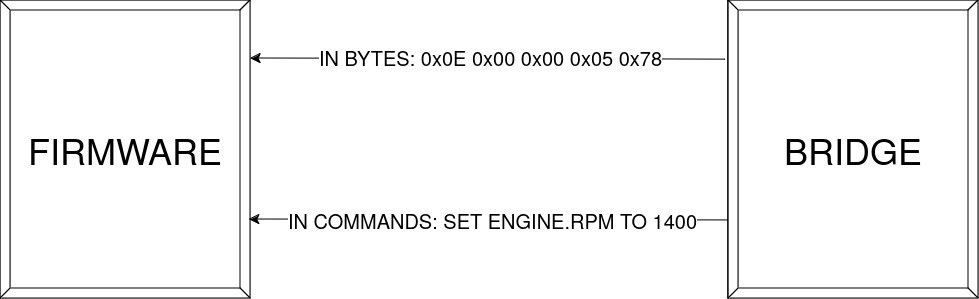
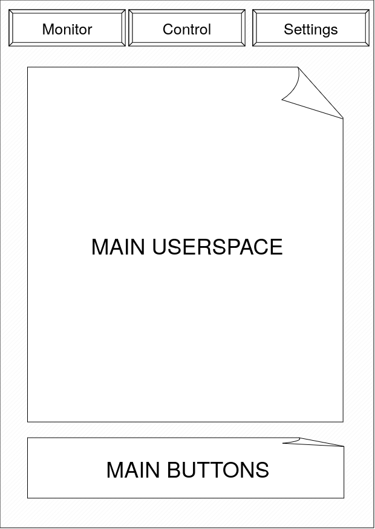

= Архітектура ПЗ
:toc:

== Aрхітектура проекту [[arch_brief]]
Проект складається з трьох основних запчастин що будуть функціонувати один від одної створюючи Supply Chain. Основними складовими пакету ПЗ будуть:

- Firmware:
    
    + Прошивка мікро-контроллера, вона включає в себе увесь відповідний функціонал для контролю фізичних запчастин що підєднані до схеми через аналогові піни.
    
    + Прошивка відправляє сигнал по USB що складаються з потоку байтів. В кінці кожного потоку записується нуль. Уся інформація передається через строки або сигнальні коди.
    
    Індикатором строки є числове значення 13 відправлене через USB інтерфейс. Після нього йде строка у стилі форматування С, де кінцем строки є NULL (0x00).

    Індикатором сигнального коду є будь яке інше число окрім (13) що відповідатиме часто-застосовуваній події у мікросхемі.

- Bridge
    
    "Міст" - це программа написана на любій низькорівневій мові (C,C++,Rust,ASM,V,D,Zig) що має доступ до системного інтерфесу USB (/dev/tty0/USB). Міст буде безпосереднім організатором спілкування мікросхеми з ПЗ. Він буде считувати дані з USB фалу-девайса та парсити їх у читаємі команди, і навпаки. Ця програма буде записувати та считувати команди у 2 спеціальні фали. Файли інтерфесу.

- Control Panel

    Панель керування - це ПЗ написане на любій мові програмування що має доступ до читання та запису файлів. Панель є графічним застосунком що надаватиме змогу керувати та моніторити стан мікросхеми.

    Усю інформацію та побажання для виконання на мікросхемі ПЗ буде записувати та считувати з інтерфес файлів. А точніше:
       .in  - файл для відправки на мікросхему через МІСТ
       .out - файл для отримання даних через МІСТ
    Програма також матиме можливість бути налаштованою через вкладку налаштувань, усі зміни будуть внесені в конфігураційний файл.

.Графічне зображення архітектури стеку ПЗ

== Cтандарт вводу та виводу у Firmware

Firmware має просту схему вводу та виводу. Першим іде індетифікатор параметру що займає 1 байт і можу відображати 0-127 кодів, після чого побайтово йде значення параметру. Розмір і тип інформації задається напряму кодом параметра, і є постійним (константним) значенням. 

У випадку якщо не вдалось виконати дію за будь-яким кодом окрім (20,21,13), буде надіслано код 21 що означає помилку, після чого може бути 0, що означає не відому помилку. Чи 13, що означає строку. Будь яке інше значення буде означати номер дії з якою відбулася помилку, без детальної інформації чому вона виникла.

=== Список індетифікаційних кодів:

.коди считування (1-11)
- 1 => Get Board Port (uint_t8)
- 2 => Get When was the last update (long)
- 3 => Get Engine RPM (float)
- 4 => Get Engine Voltage in millivolts      (float)
- 5 => Get Engine Rotation direction (bool/char/u8)
- 6 => Get Engine Pin (uint_t8)
- 7 => Get Is OnBoard Button pressed (bool/char/u8)
- 8 => Get when OnBoard Button was last pressed (long)
- 9 => Get Is External Button pressed (bool/char/u8)
- 10 => Get when External Button was last pressed (long)
- 11 => Get External Button pin (uint_t8)
- 12 => Get is LED flashed

.cпец коди (1)
- 13 => Indicates A Text message (uknown, read until NULL)

.коди запиту
- 14 => Set Engine RPM (float)
- 15 => Set Engine Rotation direction (bool/char/u8)
- 16 => Set Engine Voltage in millivolts (float)
- 17 => Set LED to light up (all colors, white) (bool,char,u8)
- 18 => Set LED blinking frequency in times per second, 0 is equal to NO_BLINKING (uint)
- 19 => Set need for board to send CALL signal in response

.коди відповіді (2)
- 20 => CALL response (refer to 19)
- 21 => ERROR response (refer to (1-11))

.коди керування 
- 100 => Reset Firmware state to defaults.

=== Приклад спілкування двох сторін

== Cтандарт спілкування між Панелью керування та "Мостом"

Як зазначено в <<arch_brief>>, основним способ спілкування графічного інтерфейсу з мостом є два інтерфес файли.

Файли є інтерфесними, бо саме через них буде проходити передача даних у реальному часі. **Причин обирання файла як способу комунікації є кілька:**

- це дуже швидкий та легкий спосіб організувати передачу даних двома процессами.
- API файлової системи доступне в переважній більшості мов програмування, на відміну від пітримки роботи IPC (Inter Process Communication) чи TCP серверу.
- Файли э постійним і надійним буфером для зберігання даних.
- Запис та считування файла має не меншу швидкість ніж TCP, і значно більшу ніж IPC
- Підтримка роботи у файловій системі присутнє і однакове в УСІХ ОС.

**Недоліками такого методу є:**

- Можливість користувача чи стороньої особи втручатись у команди за межами графічного ПЗ

На щастя у випадку з цим проектом, ПЗ не створюватиме негативних наслідків, від зміни файлу інтерфейса, а навпаки надаватиме користувачу більший контроль.

=== Формат файлів інтерфесу

Обираючи між двома формами зберігання даних: бінарною та текстовою, я вирішив використати текстову бо:

- Користувач матиме можливість редагувати дані для вводу на мікросхему користуючись зручними для нього методами.

- Користувач сможе легко парсити та лексувати дані з виводу для форматованого зберігання чи виводу.

=== Список параметрів для отримання та відправки на Firmware мікросхеми.

.дані для отрмання (формат .out)
    
    BOARD.port: (int)
    BOARD.lastanswer: (float)
    BOARD.ENGINE.rpm: (float)
    BOARD.ENGINE.volt: (float)
    BOARD.ENGINE.rotdir: (bool)
    BOARD.ENGINE.pin: (uint_t8)
    BOARD.ENGINE.NATIVE.ispressed: (bool)
    BOARD.ENGINE.NATIVE.lastanswer: (float)
    BOARD.ENGINE.EXTERN.ispressed: (bool)
    BOARD.ENGINE.EXTERN.lastanswer: (float)
    BOARD.ENGINE.EXTERN.pin: (uint_t8)

.дані для відправки (формат .in)

    ASK.rpm: (int)
    ASK.rotdir: (decimal/int) (0/1)
    ASK.volt: (float)
    ASK.ledup: (bool)
    ASK.ledblinkfreq: (int)
    ASK.callback: (bool)

== Панель керування

Панель керування має мати простий інтерфейс що надавав би змогу користувачу вільно моніторить та модифікувать стан схеми через дві вкладки:

- Монітор
- Керування

Також для базового задовільнення користувача мають бути присутні налаштунки, що дозволять змінити тему чи, наприклад, відкрити додаткові поля керування або моніторингу

=== Приклад макету користувацького інтерфесу

